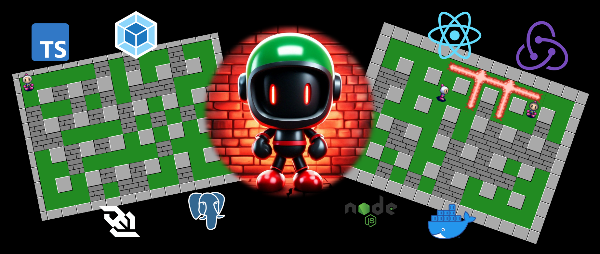

 


<div align="center">
    <h1>Bomb Attack (pet)</h1>
    <p style="font-size: 18px; margin-bottom: 0;">Многопользовательская онлайн игра bomberman прямо в браузере</p>
    <p style="font-size: 18px;">Вспомни ощущения из дества!</p>
    
    <div>
        <a href="https://bomb.prilepinva.ru/" target="_blank" style="font-size: 24px;">bomb.prilepinva.ru</a>
    </div>
</div>


## Архитектура проекта

### Frontend

##### Арзитектура

Проект написан в соответствии с методологией **[Feature Sliced Design](https://feature-sliced.design/docs/get-started/tutorial)**
Модули. Декомпозиция. Слабое зацепление и сильная связность. Переиспользование.

##### Конфигурация

 - Webpack - Кстомная конфигурация проекта. Грамотная декомпозиция конфига
 - (Vite) - альтернативный сборщик
 - React 18, Typescript, Babel, Scss, css modules, react-router-dom v6
 - prettier, eslint + кастомные линтеры для архитектуры [NPM](https://www.npmjs.com/package/eslint-plugin-fsd-project)
 - Тестирование: unit, rtl, e2e, генерация отчетов
 - Тестовая среда: jest, rtl, storybook, loki, Cypress

##### UI

Библиотека компонентов. Более 20 UI компонентов, включая модальные окна с порталами, выпадающие списки\меню, сайдбар, кнопки с разными темами, скелетоны, попапы, ленивые изображения, drawer, аватары, вертикальные и горизонтальные стеки и тд.

##### Оптимизация

- Асинхронные компоненты. Асинхронные Redux редюссеры. Reducer manager + кастомная библиотека по внедрению асинхронных редюсеров. 
- Изоляция модулей. 
- Throttle и debounce. 
- Инъекция эндпоинтов для лучшего code splitting. 
- Асинхронная загрущка библиотек (для анимаций).
- Нормализация данных (EntityAdapter)

##### Автоматика

- Кодогенерация: катомный скрипт для создание сущностей приложения
- Скрипты AST-анализаторы для рефакторинга
- Скрипты для автоматичекого удаления кода в рамках концепции feature flags
- Вополнение тестов перед коммитом (husky)

### Backend

- Node.js express сервер для предоставления API.
- Архитектура: MVC. 
- База данных: postgres. ORM: Sequelize, Sequelize-typescript
- Авторизация пользователей: JWT-tokens
- Для базы данных pet-страниц - JsonServer

### Sockets

- SocketIo & Node.js express сервер - предоставляет соединения по WebSockets для режима мультиплеера в игре

### Game core

- Механизм игры и сущности написаны на typescript, в концепциях ООП
- Движок организован с помощию `requestAnimationFrame`
- Отображение сущностей на слоях Canvas с помощью спрайтов 

### Deploy

Развертывание приложение организовано с помощью docker-контейнеров и конфигураций совместного использования docker-compose

Контейнеры проекта:

- **frontend** - nginx-сервер для раздачи статики клиентской части приложения
- **api** - express-сервер для предоставления API
- **json** - json-сервер для предоставления API
- **sockets** - express-сервер & sokcet.io для предоставления соединения по WebSockets
- **postgres** - postgres-контейнер для БД
- **storybook** - nginx-сервер для раздачи статики story-кейсов клиентского приложения
- **nginx** - главный nginx-сервер пробрасывания запросов в другие контейнеры
- **certbot** - certbot-контейнер для выпуска ssl сертификатов


---

## Скрипты

#### Установка

- `yarn install` - установка зависимостей

#### Разработка

- `yarn dev` - запуск всего проекта и отслеживание изменений
- `yarn dev:api` - запуск сервера API и мокового JSON-сервера и отслеживание изменений
- `yarn dev:sockets` - запуск сервера WebSockets для мультиплеера и отслеживание изменений
- `yarn dev:frontend` - запуск клиентской части проекта и отслеживание изменений (webpack)
- `yarn dev:vite` - запуск клиентской части проекта и отслеживание изменений (vite)
- `yarn storybook`: запуск сервера storybook и отслеживание изменений,

#### Сборка и запуск
- `yarn build:prod` - сборка всего проекта в режиме production
- `yarn build:dev` - сборка всего проекта в режиме development
- `yarn storybook:build`: сборка статики storybook,

Сборка выпосляется в дирректории: `./build-frontend`, `./build-api`, `./uild-json`, `./build-sockets`

- `yarn start:api` - запуск сервера API
- `yarn start:json` - запуск мокового JSON-сервера
- `yarn start:sockets` - запуск сервера WebSockets для мультиплеера

#### Проверка линтинга

- `yarn lint` - проверка проекта на наличие стилистических ошибок и ошибок typescript
- `yarn lint:fix` - проверка проекта на наличие стилистических ошибок и ошибок typescript + автоматическое исправление

#### Тестирование

- `yarn test:unit` - выполнение unit-тестов и rtl-тестов
- `yarn test:ui` - сборка статики storybook и проверка скриншотных тестов,
- `yarn test:ui:ok` - подтверждение изменений скриншотных тестов,
- `yarn test:ui:report` - генерация отчетов unit- и скриншотных тестов,
- `yarn test:e2e` - запуск cypress для e2e тестирования

#### Деплой

- `yarn deploy` - запуск докер-контейнеров проекта,
- `yarn deploy:build` - сборка и запуск докер-контейнеров проекта,

#### Другие

- `yarn generate:slice <имя слоя> <имя слайса>` - генерация кода: новый FSD-слайс

----

## Работа с переводами

В проекте используется библиотека i18next для работы с переводами.
Файлы с переводами хранятся в public/locales.

Документация i18next - [https://react.i18next.com/](https://react.i18next.com/)

----

## Тесты

В проекте используются 4 вида тестов:
1) Обычные unit тесты на jest - `yarn test:unit`
2) Тесты на компоненты с React testing library -`yarn test:unit`
3) Скриншотное тестирование с loki `yarn test:ui`
4) e2e тестирование с Cypress `yarn test:e2e`

----

## Линтинг

В проекте используется eslint для проверки typescript кода и stylelint для проверки файлов со стилями.

Также для строгого контроля главных архитектурных принципов
используется собственный eslint plugin [eslint-plugin-fsd-project](https://www.npmjs.com/package/eslint-plugin-fsd-project),
который содержит 3 правила
1) path-checker - запрещает использовать абсолютные импорты в рамках одного модуля
2) layer-imports - проверяет корректность использования слоев с точки зрения FSD
   (например widgets нельзя использовать в features и entitites)
3) public-api-imports - разрешает импорт из других модулей только из public api. Имеет auto fix

##### Запуск линтеров
- `yarn lint:ts` - Проверка ts файлов линтером
- `yarn lint:ts:fix` - Исправление ts файлов линтером
- `yarn lint:scss` - Проверка scss файлов style линтером
- `yarn lint:scss:fix` - Исправление scss файлов style линтером

----
## Storybook

В проекте для каждого компонента описываются стори-кейсы.
Запросы на сервер мокаются с помощью storybook-addon-mock.

Файл со сторикейсами создает рядом с компонентом с расширением .stories.tsx

Запустить сторибук можно командой:
- `yarn storybook`

Подробнее о [Storybook](./docs/storybook.md)

----

## Конфигурация проекта

Для разработки проект содержит 2 конфига:
1. Webpack - ./config/build
2. vite - vite.config.ts

Оба сборщика адаптированы под основные фичи приложения.

Вся конфигурация хранится в `/config`
- /config/frontend/babel - babel
- /config/frontend/build - конфигурация webpack
- /config/frontend/storybook - конфигурация сторибука
- /config/jest - конфигурация тестовой среды
- /config/api - конфигурация webpack сервера API
- /config/sockets - конфигурация webpack сервера для WebSockets

В папке `scripts` находятся различные скрипты для рефакторинга\упрощения написания кода\генерации отчетов и тд.

----

## CI pipeline и pre commit хуки


Развертывание приложение организовано с помощью docker-контейнеров и конфигураций совместного использования docker-compose

Контейнеры проекта:

- **frontend** - nginx-сервер для раздачи статики клиентской части приложения
- **api** - express-сервер для предоставления API
- **json** - json-сервер для предоставления API
- **sockets** - express-сервер & sokcet.io для предоставления соединения по WebSockets
- **postgres** - postgres-контейнер для БД
- **storybook** - nginx-сервер для раздачи статики story-кейсов клиентского приложения
- **nginx** - главный nginx-сервер пробрасывания запросов в другие контейнеры
- **certbot** - certbot-контейнер для выпуска ssl сертификатов


Конфигурация github actions находится в /.github/workflows.
В ci прогоняются все виды тестов, сборка проекта и сторибука, линтинг.

В прекоммит хуках проверяем проект линтерами, конфиг в /.husky

----

### Работа с данными

Взаимодействие с данными осуществляется с помощью redux toolkit.
По возможности переиспользуемые сущности необходимо нормализовать с помощью EntityAdapter

Запросы на сервер отправляются с помощью [RTK query](/src/frontend/shared/api/rtkApi.ts)

Для асинхронного подключения редюсеров (чтобы не тянуть их в общий бандл) используется
[DynamicModuleLoader](/src/frontend/shared/lib/components/DynamicModuleLoader/DynamicModuleLoader.tsx)

----

### Работа с feature-flags

Разрешено использование **feature flags** только с помощью хелпера `toggleFeature`

в него передается объект с опциями 
```
{
   name: название фича-флага, 
   on: функция, которая отработает после Включения фичи 
   of: функция, которая отработает после ВЫключения фичи
}
```
Для автоматического удаления фичи использовать скрипт `remove-feature.ts`,
который принимает 2 аргумента
1. Название удаляемого фича-флага
2. Состояние (on\off)

